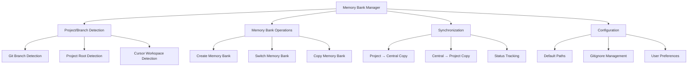
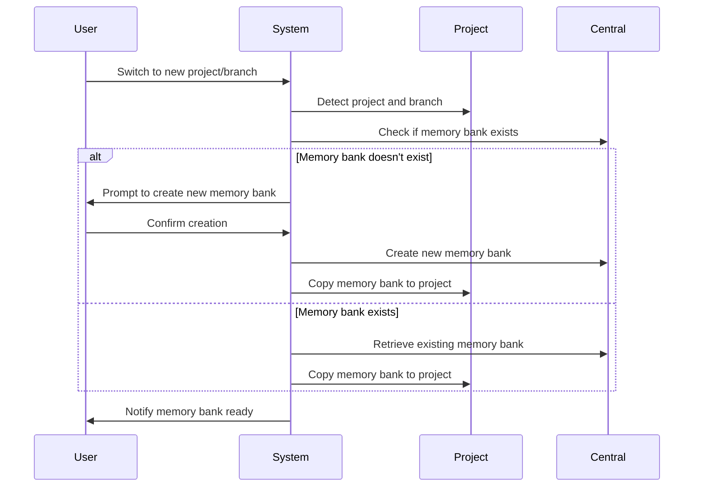
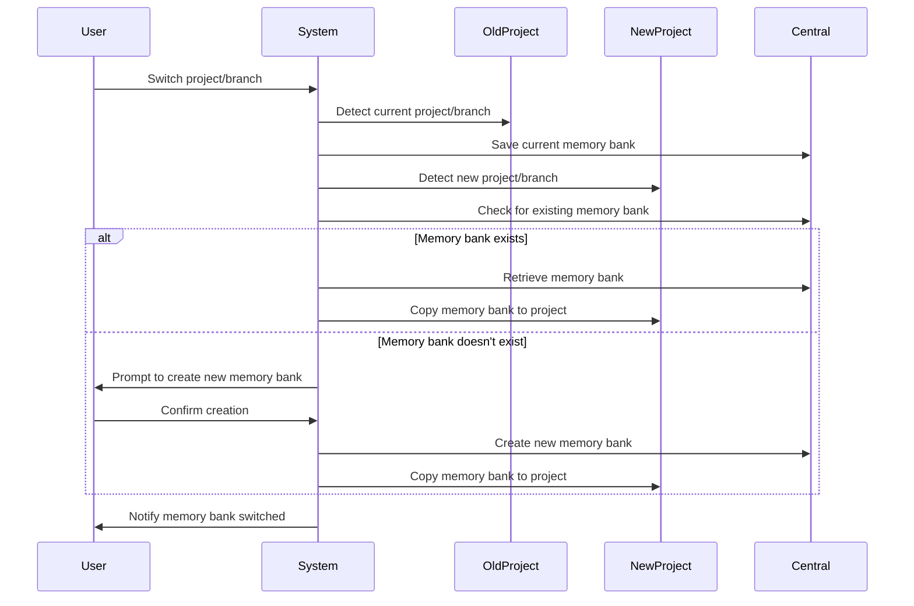
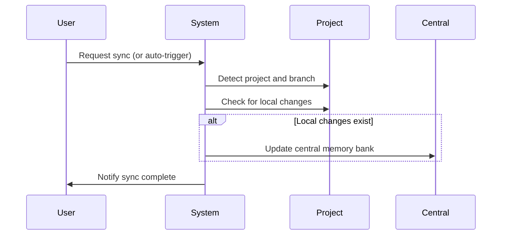

# Roo Code Memory Bank Management System

## Overview

This document outlines the architecture and implementation plan for a system that manages personalized Roo Code Memory Banks across different projects and git branches without version controlling them. The system stores memory banks in a centralized location outside project directories and automatically synchronizes them based on the current project and git branch context.

## 1. Overall Architecture



The system consists of several key components:
- **Project/Branch Detection**: Identifies the current project and git branch
- **Memory Bank Operations**: Handles creation, switching, and copying of memory banks
- **Synchronization**: Manages the two-way sync between project and central storage
- **Configuration**: Manages paths, gitignore settings, and user preferences

## 2. Directory Structure

### 2.1 Centralized Memory Bank Storage

```
~/code/ai-memory-banks/
├── david/
│   ├── project1/
│   │   ├── main/
│   │   │   ├── activeContext.md
│   │   │   ├── productContext.md
│   │   │   ├── progress.md
│   │   │   ├── decisionLog.md
│   │   │   └── systemPatterns.md
│   │   └── feature-branch/
│   │       └── ...
│   └── project2/
│       └── ...
├── gather/
│   └── ...
├── me/
│   └── ...
├── play/
│   └── ...
├── stitch/
│   └── ...
└── world/
    └── ...
```

### 2.2 Project Structure

```
~/code/domains/
├── david/
│   ├── project1/
│   │   ├── memory-bank/  # Local copy, gitignored
│   │   └── ...
│   └── project2/
│       └── ...
├── gather/
│   └── ...
├── me/
│   └── ...
├── play/
│   └── ...
├── stitch/
│   └── ...
└── world/
    └── ...
```

## 3. Naming Convention

Memory banks follow this naming convention:

```
~/code/ai-memory-banks/<domain>/<project>/<branch>/
```

Where:
- `<domain>` is one of: david, gather, me, play, stitch, world
- `<project>` is the name of the project/workspace
- `<branch>` is the git branch name

This convention ensures:
1. Easy mapping between projects and their memory banks
2. Clear separation between different branches of the same project
3. Consistent organization across all domains

## 4. Workflow Operations

### 4.1 Creating New Memory Banks



### 4.2 Switching Between Memory Banks



### 4.3 Synchronizing Memory Banks



## 5. Implementation Components

### 5.1 Shell Functions for ~/.zshrc

All implementation code will be kept in the user's personal configuration files to ensure it doesn't get tracked in version control.

#### 5.1.1 Project Detection Functions

```bash
# Detect the current project root directory
function get_project_root() {
  # Try git root first
  local git_root=$(git rev-parse --show-toplevel 2>/dev/null)
  if [[ -n "$git_root" ]]; then
    echo "$git_root"
    return 0
  fi
  
  # Try finding package.json, Cargo.toml, etc.
  # ...
  
  # Fall back to current directory
  echo "$PWD"
}

# Extract domain from project path
function get_project_domain() {
  local project_root="$1"
  if [[ "$project_root" =~ ~/code/domains/([^/]+) ]]; then
    echo "${BASH_REMATCH[1]}"
  else
    echo "unknown"
  fi
}

# Extract project name from path
function get_project_name() {
  local project_root="$1"
  echo "$(basename "$project_root")"
}

# Get current git branch
function get_git_branch() {
  git rev-parse --abbrev-ref HEAD 2>/dev/null || echo "default"
}
```

#### 5.1.2 Memory Bank Path Functions

```bash
# Get path to central memory bank
function get_central_mb_path() {
  local domain="$1"
  local project="$2"
  local branch="$3"
  
  echo "~/code/ai-memory-banks/$domain/$project/$branch"
}

# Get path to project memory bank
function get_project_mb_path() {
  local project_root="$1"
  
  echo "$project_root/memory-bank"
}
```

#### 5.1.3 Memory Bank Operations

```bash
# Create a new memory bank
function create_memory_bank() {
  local domain="$1"
  local project="$2"
  local branch="$3"
  local central_path=$(get_central_mb_path "$domain" "$project" "$branch")
  
  # Create directories
  mkdir -p "$central_path"
  
  # Create initial files
  # ...
  
  echo "Created new memory bank at $central_path"
}

# Switch to a different memory bank
function switch_memory_bank() {
  local project_root="$1"
  local domain="$2"
  local project="$3"
  local branch="$4"
  
  local project_mb=$(get_project_mb_path "$project_root")
  local central_mb=$(get_central_mb_path "$domain" "$project" "$branch")
  
  # Save current memory bank if it exists
  if [[ -d "$project_mb" ]]; then
    sync_to_central "$project_root" "$domain" "$project" "$(get_git_branch)"
  fi
  
  # Check if central memory bank exists
  if [[ ! -d "$central_mb" ]]; then
    create_memory_bank "$domain" "$project" "$branch"
  fi
  
  # Copy central to project
  rm -rf "$project_mb" 2>/dev/null
  mkdir -p "$project_mb"
  cp -r "$central_mb/"* "$project_mb/" 2>/dev/null
  
  echo "Switched to memory bank for $project ($branch)"
}

# Sync project and central memory banks
function sync_memory_bank() {
  local project_root="$1"
  local domain="$2"
  local project="$3"
  local branch="$4"
  
  # Sync in both directions
  sync_to_central "$project_root" "$domain" "$project" "$branch"
  sync_to_project "$project_root" "$domain" "$project" "$branch"
  
  echo "Synchronized memory bank for $project ($branch)"
}

# Sync from project to central
function sync_to_central() {
  local project_root="$1"
  local domain="$2"
  local project="$3"
  local branch="$4"
  
  local project_mb=$(get_project_mb_path "$project_root")
  local central_mb=$(get_central_mb_path "$domain" "$project" "$branch")
  
  # Ensure central directory exists
  mkdir -p "$central_mb"
  
  # Copy files from project to central
  if [[ -d "$project_mb" ]]; then
    cp -r "$project_mb/"* "$central_mb/" 2>/dev/null
  fi
}

# Sync from central to project
function sync_to_project() {
  local project_root="$1"
  local domain="$2"
  local project="$3"
  local branch="$4"
  
  local project_mb=$(get_project_mb_path "$project_root")
  local central_mb=$(get_central_mb_path "$domain" "$project" "$branch")
  
  # Ensure project directory exists
  mkdir -p "$project_mb"
  
  # Copy files from central to project
  if [[ -d "$central_mb" ]]; then
    cp -r "$central_mb/"* "$project_mb/" 2>/dev/null
  fi
}
```

#### 5.1.4 Utility Functions

```bash
# Ensure memory bank is in .gitignore
function ensure_gitignore() {
  local project_root="$1"
  local gitignore="$project_root/.gitignore"
  
  # Create .gitignore if it doesn't exist
  if [[ ! -f "$gitignore" ]]; then
    touch "$gitignore"
  fi
  
  # Add memory-bank to .gitignore if not already present
  if ! grep -q "^/memory-bank" "$gitignore"; then
    echo "/memory-bank" >> "$gitignore"
    echo "Added /memory-bank to .gitignore"
  fi
}

# Check if in Cursor workspace
function check_cursor_workspace() {
  # Check for Cursor-specific files or environment variables
  # This may need adjustment based on how Cursor differs from VS Code
  # ...
  
  return 0  # Default to true for now
}
```

### 5.2 User-Level Git Hooks (Not in Version Control)

To keep git hooks out of version control, we'll implement them at the user level rather than the repository level. This can be done by configuring git to use a custom hooks directory outside of the repository.

#### 5.2.1 Setup Custom Git Hooks Directory

```bash
# Add to ~/.zshrc
export GIT_HOOKS_DIR="$HOME/.git-hooks"
git config --global core.hooksPath "$GIT_HOOKS_DIR"

# Create directory if it doesn't exist
mkdir -p "$GIT_HOOKS_DIR"
```

#### 5.2.2 Pre-Checkout Hook

```bash
# $HOME/.git-hooks/pre-checkout
#!/bin/bash

# Get current project info
project_root=$(get_project_root)
domain=$(get_project_domain "$project_root")
project=$(get_project_name "$project_root")
branch=$(get_git_branch)

# Save current memory bank
sync_to_central "$project_root" "$domain" "$project" "$branch"

exit 0
```

#### 5.2.3 Post-Checkout Hook

```bash
# $HOME/.git-hooks/post-checkout
#!/bin/bash

# Get new project info
project_root=$(get_project_root)
domain=$(get_project_domain "$project_root")
project=$(get_project_name "$project_root")
branch=$(get_git_branch)

# Load appropriate memory bank
switch_memory_bank "$project_root" "$domain" "$project" "$branch"

# Ensure memory bank is gitignored
ensure_gitignore "$project_root"

exit 0
```

#### 5.2.4 Post-Merge Hook

```bash
# $HOME/.git-hooks/post-merge
#!/bin/bash

# Get current project info
project_root=$(get_project_root)
domain=$(get_project_domain "$project_root")
project=$(get_project_name "$project_root")
branch=$(get_git_branch)

# Reload memory bank after merge
switch_memory_bank "$project_root" "$domain" "$project" "$branch"

exit 0
```

### 5.3 Main Command-Line Interface

```bash
# Add to ~/.zshrc
function mb() {
  local command="${1:-status}"
  shift || true
  
  # Get current project info
  local project_root=$(get_project_root)
  local domain=$(get_project_domain "$project_root")
  local project=$(get_project_name "$project_root")
  local branch=$(get_git_branch)
  
  case "$command" in
    status)
      echo "Memory Bank Status:"
      echo "Project: $project"
      echo "Domain: $domain"
      echo "Branch: $branch"
      echo "Project Path: $project_root"
      echo "Central Path: $(get_central_mb_path "$domain" "$project" "$branch")"
      ;;
    create)
      create_memory_bank "$domain" "$project" "$branch"
      sync_to_project "$project_root" "$domain" "$project" "$branch"
      ensure_gitignore "$project_root"
      ;;
    switch)
      local target_branch="${1:-$branch}"
      switch_memory_bank "$project_root" "$domain" "$project" "$target_branch"
      ensure_gitignore "$project_root"
      ;;
    sync)
      sync_memory_bank "$project_root" "$domain" "$project" "$branch"
      ensure_gitignore "$project_root"
      ;;
    list)
      echo "Available Memory Banks for $project:"
      ls -1 "$(get_central_mb_path "$domain" "$project" "")" 2>/dev/null || echo "None found."
      ;;
    help)
      echo "Memory Bank Manager Usage:"
      echo "  mb                  Show status"
      echo "  mb create           Create new memory bank"
      echo "  mb switch [branch]  Switch to branch memory bank"
      echo "  mb sync             Sync memory bank"
      echo "  mb list             List available memory banks"
      echo "  mb help             Show this help"
      ;;
    *)
      echo "Unknown command: $command"
      echo "Run 'mb help' for usage information."
      return 1
      ;;
  esac
}
```

## 6. Edge Cases and Handling

### 6.1 New Project

When a new project is detected:

1. Check if a memory bank exists in the central location
2. If not, prompt the user to create a new memory bank
3. Initialize with default templates
4. Ensure the memory bank is added to .gitignore

### 6.2 New Branch

When a new branch is created:

1. Prompt the user with options:
   - Copy from parent branch (default)
   - Start with a fresh memory bank
2. Create the appropriate memory bank
3. Track branch lineage for context if copying from parent

### 6.3 Deleted Branch

When a branch is deleted:

1. Keep the memory bank in central storage
2. Provide commands to archive or delete if desired:
   ```bash
   # Add to mb function
   archive)
     local target_branch="${1:-$branch}"
     local central_mb=$(get_central_mb_path "$domain" "$project" "$target_branch")
     local archive_path="$(get_central_mb_path "$domain" "$project" "archive")"
     
     mkdir -p "$archive_path"
     mv "$central_mb" "$archive_path/$target_branch-$(date +%Y%m%d)"
     echo "Archived memory bank for $target_branch"
     ;;
   ```

### 6.4 Git Rebasing

When a branch is rebased onto another branch:

1. The memory bank from the base branch is merged into the rebased branch
2. A note about the rebase is added to the activeContext.md file
3. This is handled automatically by the post-rebase hook
4. A manual rebase command is also available:
   ```bash
   mb rebase <base_branch>
   ```

This ensures that when code is rebased, the memory bank context is also properly updated to reflect the new base branch's context.

### 6.5 Branch Chaining Workflow

When creating a new branch from an existing one (using `git checkout -b`):

1. The system detects this is a branch chaining operation
2. The new branch automatically inherits the memory bank from the parent branch
3. A note about the branch lineage is added to the activeContext.md file
4. This is especially useful when the previous branch is under review and you need to continue work

This workflow ensures continuity of context when working on related features across multiple branches.

### 6.6 Branch Updates and Rebasing

When working with parent and child branches:

1. Make changes to the parent branch and update its memory bank
2. Return to the child branch and rebase it on the updated parent
3. The post-rebase hook automatically merges the updated parent memory bank into the child branch
4. This ensures the child branch has the latest context from the parent

This workflow is particularly useful for maintaining up-to-date context across related branches.

### 6.7 Merge Conflicts

When conflicts occur between memory banks:

1. Prioritize the most recently modified memory bank
2. Provide a command to merge memory banks:
   ```bash
   # Add to mb function
   merge)
     local source_branch="$1"
     local central_source=$(get_central_mb_path "$domain" "$project" "$source_branch")
     local central_target=$(get_central_mb_path "$domain" "$project" "$branch")
     
     # Merge logic here
     # ...
     
     echo "Merged memory bank from $source_branch into $branch"
     ;;
   ```

### 6.8 Non-Git Projects

For projects not using git:

1. Fall back to project name only
2. Use "default" as the branch name
3. Still maintain the same directory structure for consistency

## 7. Gitignore Management

### 7.1 Project-level .gitignore

The system automatically ensures memory banks are properly gitignored:

1. Check for .gitignore file in project root
2. Create if it doesn't exist
3. Add `/memory-bank/` entry if not present
4. Verify on every memory bank operation

### 7.2 Global .gitignore

Optionally, add to global gitignore:

```bash
# Add to setup function
function setup_global_gitignore() {
  local global_gitignore="$HOME/.gitignore_global"
  
  # Create global gitignore if it doesn't exist
  if [[ ! -f "$global_gitignore" ]]; then
    touch "$global_gitignore"
    git config --global core.excludesfile "$global_gitignore"
  fi
  
  # Add memory-bank to global gitignore
  if ! grep -q "memory-bank/" "$global_gitignore"; then
    echo "memory-bank/" >> "$global_gitignore"
    echo "Added memory-bank/ to global gitignore"
  fi
}
```

### 7.3 Verification

Periodically verify gitignore status:

```bash
# Add to mb function
check)
  local project_mb=$(get_project_mb_path "$project_root")
  
  # Check if memory-bank is gitignored
  if git check-ignore -q "$project_mb" 2>/dev/null; then
    echo "✅ Memory bank is properly gitignored"
  else
    echo "⚠️ Warning: Memory bank may not be gitignored!"
    echo "Run 'mb fix-gitignore' to fix this issue."
  fi
  ;;

fix-gitignore)
  ensure_gitignore "$project_root"
  setup_global_gitignore
  echo "Fixed gitignore settings"
  ;;
```

## 8. Git Hooks

### 8.1 pre-checkout

The pre-checkout hook saves the current memory bank before switching branches:

```bash
# Get current project info
project_root=$(get_project_root)
domain=$(get_project_domain "$project_root")
project=$(get_project_name "$project_root")
branch=$(get_git_branch)

# Save current memory bank
sync_to_central "$project_root" "$domain" "$project" "$branch"
```

### 8.2 post-checkout

The post-checkout hook loads the appropriate memory bank after switching branches:

```bash
# Get new project info
project_root=$(get_project_root)
domain=$(get_project_domain "$project_root")
project=$(get_project_name "$project_root")
branch=$(get_git_branch)

# Detect if this is a new branch creation
is_new_branch=false
previous_branch=""

# Check if the branch was just created
if [[ "$PREV_HEAD" != "$NEW_HEAD" ]]; then
  # Get the previous branch name
  previous_branch=$(git name-rev --name-only "$PREV_HEAD" 2>/dev/null)
  
  # Check if this is a new branch by looking at the reflog
  if git reflog -1 | grep -q "checkout: moving from $previous_branch to $branch"; then
    # This appears to be a branch chain (checkout -b) scenario
    is_new_branch=true
  fi
fi

# Handle branch chaining if detected
if [[ "$is_new_branch" == "true" && -n "$previous_branch" ]]; then
  # Copy memory bank from parent branch
  copy_memory_bank "$domain" "$project" "$previous_branch" "$domain" "$project" "$branch"
else
  # Regular branch switching
  switch_memory_bank "$project_root" "$domain" "$project" "$branch"
fi
```

### 8.3 post-merge

The post-merge hook updates the memory bank after merging branches:

```bash
# Get current project info
project_root=$(get_project_root)
domain=$(get_project_domain "$project_root")
project=$(get_project_name "$project_root")
branch=$(get_git_branch)

# Update memory bank in central storage
sync_to_central "$project_root" "$domain" "$project" "$branch"

# Add a note about the merge to activeContext.md
project_mb=$(get_project_mb_path "$project_root")
if [[ -f "$project_mb/activeContext.md" ]]; then
  # Get the merged branch name from git reflog
  merged_branch=$(git reflog -1 | grep -o "merge [^:]*" | sed 's/merge //')
  
  if [[ -n "$merged_branch" ]]; then
    echo -e "\n## Merge Event\n\n* $(date +"%Y-%m-%d %H:%M:%S") - Merged branch $merged_branch into $branch\n" >> "$project_mb/activeContext.md"
  fi
fi
```

### 8.4 post-rebase

The post-rebase hook updates the memory bank after rebasing branches:

```bash
# Get current project info
project_root=$(get_project_root)
domain=$(get_project_domain "$project_root")
project=$(get_project_name "$project_root")
branch=$(get_git_branch)

# Get the base branch that was rebased onto
base_branch=$(git reflog -1 | grep -o "onto [^:]*" | sed 's/onto //' | cut -d' ' -f1)

# Update memory bank in central storage
sync_to_central "$project_root" "$domain" "$project" "$branch"

# Add a note about the rebase to activeContext.md
project_mb=$(get_project_mb_path "$project_root")
if [[ -f "$project_mb/activeContext.md" ]]; then
  if [[ -n "$base_branch" ]]; then
    echo -e "\n## Rebase Event\n\n* $(date +"%Y-%m-%d %H:%M:%S") - Rebased branch $branch onto $base_branch\n" >> "$project_mb/activeContext.md"
    
    # Merge memory banks if base branch has a memory bank
    base_mb=$(get_central_mb_path "$domain" "$project" "$base_branch")
    if [[ -d "$base_mb" ]]; then
      # Merge the base branch memory bank into the current branch
      merge_memory_banks "$domain" "$project" "$base_branch" "$domain" "$project" "$branch"
    fi
  fi
fi
```

## 9. Installation and Setup

### 9.1 Installation Script

Create a script that:

1. Sets up the directory structure
2. Adds functions to ~/.zshrc
3. Configures git hooks
4. Sets up initial gitignore rules

```bash
#!/bin/bash
# Memory Bank Manager Installation Script

# Create directory structure
mkdir -p ~/code/ai-memory-banks/{david,gather,me,play,stitch,world}

# Add functions to ~/.zshrc
cat >> ~/.zshrc << 'EOL'
# Memory Bank Manager Functions
# ... (all functions defined above) ...

# Initialize on shell startup
export GIT_HOOKS_DIR="$HOME/.git-hooks"
git config --global core.hooksPath "$GIT_HOOKS_DIR"
EOL

# Create git hooks directory
mkdir -p "$HOME/.git-hooks"

# Copy git hooks
cp pre-checkout "$GIT_HOOKS_DIR/"
cp post-checkout "$GIT_HOOKS_DIR/"
cp post-merge "$GIT_HOOKS_DIR/"
cp post-rebase "$GIT_HOOKS_DIR/"

# Make hooks executable
chmod +x "$HOME/.git-hooks"/*

# Setup global gitignore
setup_global_gitignore

echo "Memory Bank Manager installed successfully!"
```

### 8.2 First-Time Setup

When first using the system:

1. Run the installation script
2. Source ~/.zshrc or restart the terminal
3. Navigate to a project
4. Run `mb status` to verify setup
5. Run `mb create` to create your first memory bank

## 10. Cursor Integration Considerations

Since you're using Cursor (a fork of VS Code) instead of VS Code native:

1. The system primarily relies on filesystem and git operations, which should work the same in Cursor
2. Any Cursor-specific behavior can be handled in the `check_cursor_workspace()` function
3. If Cursor has different workspace detection mechanisms, these can be adapted as needed
4. The system is designed to be editor-agnostic, focusing on the filesystem and git

## 11. Privacy and Version Control Considerations

To ensure the memory bank management system remains private and doesn't get tracked in version control:

1. All implementation code lives in ~/.zshrc or other user-level configuration files
2. Git hooks are configured at the user level, not the repository level
3. The memory-bank directory is automatically added to .gitignore
4. A global gitignore rule is added as a fallback
5. The `mb check` command verifies that memory banks are properly gitignored
6. No repository-level configuration files are modified in a way that would be tracked

This approach ensures that:
- Your workflow remains private
- No traces of the memory bank system appear in version control
- Other team members won't see any changes related to this system
- You can use the system across multiple repositories without leaving traces

## Conclusion

This memory bank management system provides a robust solution for maintaining personalized Roo Code Memory Banks across different projects and git branches. By storing memory banks in a centralized location and automatically synchronizing them based on the current context, it ensures that you always have the right context available while keeping this workflow private and out of version control.